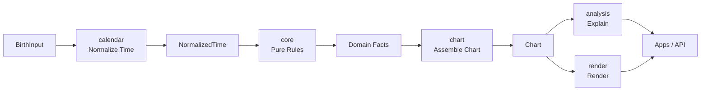

# ziwei 架构设计

本文档定义 `ziwei` 的目标架构。它回答的不是“现在代码写到哪里了”，而是“这个系统应该如何被设计、约束和长期演进”。

`ziwei` 的核心使命是为紫微斗数软件提供一套可验证、可扩展、可长期维护的开源基础设施。架构的首要目标不是功能堆叠，而是把最难回头的边界一次划对：时间归一化、规则计算、命盘组装、解盘解释、命盘渲染，各自独立、顺序明确、职责单一。

## 1. 架构驱动力

系统设计由以下五个驱动力约束：

### 1.1 正确性优先

排盘系统最核心的价值是“同一输入得到同一结果”。任何隐藏的时区、系统时间、外部环境差异，都会直接破坏可信度。因此架构必须保证：

- 所有时间边界都显式建模。
- 所有计算都以显式输入为前提。
- 不允许依赖系统时区、运行时网络和隐式全局状态。

### 1.2 可追溯性

命盘不是黑盒结果，而是一个可解释的中间资产。系统中的每一层都应当让上层能回答两个问题：

- 这个结论来自哪一条规则。
- 这个渲染结果对应命盘中的哪一个结构。

### 1.3 分层隔离

历法、计算、解释、渲染、应用交互是五个不同问题域。它们必须解耦，否则任何一个变化都会沿着代码库横向蔓延。

### 1.4 确定性扩展

系统要支持更多流派、规则集、分析器、渲染主题，但扩展必须建立在稳定的中心模型之上，而不是让每个扩展点重新发明一套数据结构。

### 1.5 库优先而非应用优先

`ziwei` 首先是基础设施，而不是某个单一应用。架构应优先服务于：

- 可被多个应用复用
- 可被测试和验证
- 可被第三方程序消费
- 可被长期发布和版本化

### 1.6 明确非目标

为了防止架构目标漂移，以下内容不属于本项目的顶层架构目标：

- 不在 `core` 中内嵌 AI、文案生成或任何启发式解释逻辑
- 不在 `apps` 中回填底层规则缺口
- 不为尚未出现的流派差异预建通用抽象框架
- 不把渲染定制、交互状态或平台能力带回领域层
- 不依赖运行时在线数据源完成核心排盘

## 2. 架构总览

系统采用单向、分层、以 `Chart` 为中心资产的架构：

```text
calendar → core → chart → [analysis, render] → apps
```

这不是简单的包顺序，而是一条不可逆的数据责任链：

- `calendar` 把原始出生信息归一化为统一时间语义。
- `core` 根据统一时间语义执行纯规则计算。
- `chart` 负责唯一一次命盘组装，产出标准 `Chart`。
- `analysis` 基于 `Chart` 生成解释，不改写 `Chart`。
- `render` 基于 `Chart` 生成渲染结果，不重算命盘。
- `apps` 负责交互、编排和展示，不承担底层规则职责。



## 3. 核心领域划分

系统分为五个领域，每个领域都有唯一职责。

| 领域                | 责任                 | 输入                                    | 输出             | 不负责                         |
| ------------------- | -------------------- | --------------------------------------- | ---------------- | ------------------------------ |
| 时间领域 `calendar` | 历法归一化与边界裁决 | 原始出生输入                            | `NormalizedTime` | 命盘解释、宫位安星、渲染       |
| 规则领域 `core`     | 纯计算规则与基础模型 | 归一化后的时间索引与规则参数            | 可组合的领域事实 | 输入解析、命盘组装、文案输出   |
| 组装领域 `chart`    | 统一命盘生成入口     | `BirthInput` 或 `NormalizedTime` + 配置 | `Chart`          | 规则定义、文案解释、图形渲染   |
| 解释领域 `analysis` | 基于命盘的解释与分析 | `Chart`                                 | `AnalysisResult` | 修改命盘、重新排盘、图形布局   |
| 呈现领域 `render`   | 基于命盘的布局与渲染 | `Chart` + 主题/尺寸配置                 | 渲染结果         | 解释逻辑、规则计算、时间归一化 |

这五个领域是架构中的一级边界，不能交叉吞并。

## 4. 规范化数据流

### 4.1 输入资产：`BirthInput`

系统接收的原始输入统一称为 `BirthInput`。它代表用户提供的出生事实，而不是系统已经认定的命理事实。

`BirthInput` 的设计原则：

- 支持多种输入形态：公历、农历、干支历。
- 时区、经度、地区、历法分界规则必须显式提供或显式默认。
- 性别、流派、边界规则等会影响解释或计算的参数必须进入输入配置，而不是藏在全局配置里。

### 4.2 标准时间资产：`NormalizedTime`

`NormalizedTime` 是系统的第一份标准资产。它是所有命理计算的共同前提。

它的职责不是“记住用户输入了什么”，而是“把用户输入裁决为唯一的时间语义结果”。它至少应具备：

- 唯一确定的历法上下文
- 明确的年 / 月 / 日 / 时边界结果
- 显式的时区、经度和边界规则来源
- 可用于后续计算的索引化时间数据

架构上，只有 `calendar` 能生产 `NormalizedTime`。

### 4.3 领域事实资产：`Domain Facts`

`core` 不直接输出完整命盘，而是输出可组合、可测试的领域事实，例如：

- 宫位索引
- 天干地支排布
- 星曜定位结果
- 四化结果
- 宫位关系和附属标记

这些事实必须满足两个条件：

- 可独立测试
- 可被 `chart` 组合，但不依赖 `chart`

### 4.4 核心资产：`Chart`

`Chart` 是整个系统的中心资产，也是系统最重要的架构边界。

`Chart` 的地位：

- 是 `chart` 的唯一标准输出
- 是 `analysis` 的唯一事实输入
- 是 `render` 的唯一渲染输入
- 是应用层、API 层和外部生态应当依赖的主要数据模型

`Chart` 必须是：

- 完整的：足以支撑解释和渲染
- 稳定的：避免把内部算法细节直接暴露成脆弱接口
- 只读的：下游只能消费，不能回写
- 可序列化的：便于缓存、存储、调试和跨端传递

### 4.5 衍生产物：`AnalysisResult` 与渲染结果

`Chart` 之上允许存在两类衍生产物：

- `AnalysisResult`：文本、标签、结构化洞察、格局识别结果
- 渲染结果：布局模型、绘制指令、Canvas / Image 输出

二者都属于只读投影，不得反向影响 `Chart`。

## 5. 分层职责与内部结构

### 5.1 `calendar`: 时间归一化层

`calendar` 负责把“模糊的出生输入”裁决为“唯一的标准时间语义”。

它解决的问题包括：

- 公历 / 农历 / 干支历输入归一化
- 换年、换月、换日、子时跨日等边界规则
- 节气、时区、真太阳时、夏令时等时间语义
- 统一输出可供命理计算消费的时间结构

架构要求：

- `calendar` 可以依赖必要的历法或天文数据，但这些依赖必须可控、可验证、可版本化。
- 运行时不得依赖远程接口。
- 结果必须显式标注所依据的边界规则。

### 5.2 `core`: 纯规则计算层

`core` 是整个系统的数学和规则内核。它只接受显式输入，执行纯计算，返回稳定结果。

`core` 内部推荐保持三类结构：

- `constants/`: 天干、地支、星曜、宫位、映射表、固定规则表
- `rules/`: 安宫、安星、四化、关系推导等可测试算法
- `models/`: 仅服务于计算域的类型定义

架构要求：

- 零外部 npm 依赖
- 零 I/O
- 零全局可变状态
- 同样输入必须严格返回同样输出

### 5.3 `chart`: 命盘组装层

`chart` 是系统的统一编排器，也是唯一合法的排盘入口。

它的职责不是重新定义规则，而是：

- 接收调用方输入
- 驱动 `calendar`
- 调用 `core`
- 组装 `Chart`
- 输出稳定的、对上层友好的标准命盘

`chart` 是架构上的“防分叉层”。任何想得到命盘的上层能力，都必须经过它，而不是直接拼装 `core` 的中间结果。

### 5.4 `analysis`: 解释层

`analysis` 负责把 `Chart` 投影为人类可读的解释结果。

推荐采用三段式内部管线：

- `facts`: 从 `Chart` 中抽取可解释事实
- `patterns`: 基于规则识别结构、格局、关系
- `narratives`: 组织为结构化文本、标签或解释块

架构要求：

- 只读消费 `Chart`
- 不修改命盘
- 不依赖渲染层
- 解释结果必须能追溯到命盘事实和分析规则

### 5.5 `render`: 渲染层

`render` 负责把 `Chart` 投影为视觉结果。

推荐采用三段式内部管线：

- `layout`: 从命盘结构推导宫位和元素布局
- `scene`: 生成与渲染后端解耦的中间场景或绘制指令
- `paint`: 输出 Canvas、位图或其他图形目标

这使得渲染系统具备两个关键能力：

- 布局逻辑与具体绘制后端分离
- 主题、尺寸、字体策略可扩展而不污染命理规则

## 6. 依赖契约

架构只允许顺流依赖，不允许逆流依赖，不允许跨层偷取内部实现。

### 6.1 允许的依赖

```text
calendar → none 或受控时间数据依赖
core → none
chart → calendar + core
analysis → chart 的公共 Chart 类型
render → chart 的公共 Chart 类型
apps → chart + analysis + render
```

### 6.2 明确禁止的依赖

- `core` 依赖 `calendar`
- `core` 依赖 `chart`
- `analysis` 依赖 `core` 内部规则函数
- `render` 依赖 `core` 内部规则函数
- `apps` 直接调用 `core` 或 `calendar` 的内部实现
- 任意包跨越 `src/index.ts` 直接引用其他包私有文件

### 6.3 唯一公共出口

每个包只能通过自己的 `src/index.ts` 暴露公共 API。其余文件默认视为私有实现。

这个约束非常关键，因为它决定：

- 发布面多大
- 兼容性承诺落在什么地方
- 重构时哪些改动可以自由进行

## 7. 关键不变量

以下不变量属于架构级约束，不能在具体实现中被弱化。

### 7.1 只有 `calendar` 可以裁决时间语义

任何换年、换月、换日、子时、时区、真太阳时逻辑，都必须在 `calendar` 内部完成。其他层只能消费结果，不能私自二次裁决。

### 7.2 只有 `chart` 可以生成 `Chart`

`Chart` 必须有唯一生产者。这样才能保证：

- 命盘结构稳定
- 上层依赖一致
- 测试和版本演进可控

### 7.3 `analysis` 和 `render` 只能投影，不能改写

解释和渲染都是对命盘的消费，而不是继续制造新的命理事实。它们可以扩展视图，不可以反向修改基础资产。

### 7.4 `core` 必须保持纯函数语义

只要进入 `core`，一切结果都应当由输入唯一决定。`core` 不感知环境，不执行副作用，不保存状态。

## 8. 扩展策略

高质量架构不是为今天的需求写死，而是为未来的变化预留正确位置。

### 8.1 流派扩展

不同流派的差异主要体现在：

- 时间边界规则
- 某些安星规则
- 某些分析解释逻辑

正确的扩展方式是：

- 时间差异进入 `calendar` 配置
- 规则差异进入 `core` / `chart` 的显式规则集
- 解释差异进入 `analysis` 的分析器或策略

而不是在应用层用条件分支到处修补。

### 8.2 渲染扩展

主题、字体、宫格样式、导出尺寸等都属于渲染扩展，应限制在 `render` 域内。渲染定制不能倒灌回命理模型。

### 8.3 应用扩展

Web、Desktop、CLI、API 服务都属于 `apps` 域。它们共享底层命盘资产，但不共享底层内部实现。

## 9. 非功能性架构约束

### 9.1 可测试性

每层都必须有天然可测试的最小单位：

- `calendar`: 边界裁决用例
- `core`: 规则函数
- `chart`: 端到端排盘结果
- `analysis`: 解释规则和输出结构
- `render`: 布局快照和渲染结果

### 9.2 可版本化

公开 API 必须尽量少而稳，内部实现可自由演化。架构上不鼓励过早暴露底层中间结构。

### 9.3 可移植性

基础包应当天然适配 Node、浏览器和未来的跨端宿主环境。任何平台专属能力都应被隔离在最上层。

### 9.4 可审计性

架构必须支持“为什么得到这个结果”的排查路径。后续如需加入调试模式、规则追踪或解释证据链，也应建立在当前分层之上，而不是打破分层。

### 9.5 失败语义清晰

错误必须在最接近根因的层被识别和表达：

- `calendar` 负责报告无效输入、边界冲突、不可裁决的时间语义
- `core` 负责报告不合法的规则前置条件
- `chart` 负责把底层错误收敛为统一的排盘错误边界
- `analysis` 和 `render` 不得默默修正命盘，只能显式失败或降级输出

系统宁可失败得明确，也不能“看起来成功但结果不可信”。

## 10. 推荐落地顺序

为了让实现过程与架构一致，推荐按以下顺序建设：

1. 完成 `calendar` 的标准时间模型和边界裁决能力。
2. 完成 `core` 的基础规则域，并固化纯函数测试。
3. 设计稳定的 `Chart` 结构。
4. 实现 `chart` 作为唯一排盘入口。
5. 在 `Chart` 稳定后接入 `analysis`。
6. 在 `Chart` 稳定后接入 `render`。
7. 最后构建 `apps` 层。

这个顺序不是项目管理偏好，而是架构要求。倒序建设会导致上层模型先行固化，反向绑架底层设计。

## 11. 结论

`ziwei` 的顶层架构不是“很多包放在 monorepo 里”，而是一套围绕单一核心资产 `Chart` 建立的责任链：

- `calendar` 保证时间语义唯一
- `core` 保证规则计算纯净
- `chart` 保证命盘出口唯一
- `analysis` 保证解释只读且可追溯
- `render` 保证渲染只投影不算命
- `apps` 保证交互层不污染领域层

只要这条链不被打破，系统就能在功能增长、规则扩展和应用拓展中保持清晰、可信和可维护。
