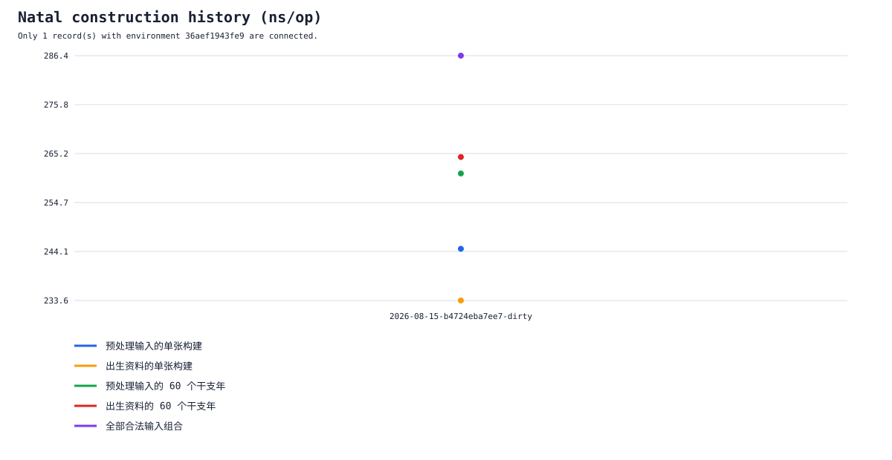

# Ziwei 基准测试结果

> 本页由 `zig build benchmark-publish` 生成，展示经过显式发布的本命盘构建报告。只读查询目前不在测量范围内。

## 最新已发布记录

- 记录：[`2026-08-15-b4724eba7ee7-dirty`](runs/2026-08-15-b4724eba7ee7-dirty/report.md)
- 版本：`b4724eba7ee7-dirty`
- 结论：当前速度快照，尚无旧结果
- 当前速度：构建一张命盘约需 0.234–0.286 微秒；连续单线程计算约为每秒 3.49–4.28 百万张。
- 环境：`lzm0x219s-MacBook-Pro.local`，`Apple M4 Max`，`aarch64-macos-none`，Zig `0.16.0`，14 个逻辑核心；指纹 `36aef1943fe9`。
- 可比较基线：`暂无干净基线`。

完整的大白话总结、统计表和全部图表见[本次报告](runs/2026-08-15-b4724eba7ee7-dirty/report.md)。

## 同环境历史趋势

趋势图只连接环境指纹与最新记录完全相同的数据；其他机器的结果不会混成一条线。

## 历史记录

| 记录 | 版本 | 环境 | 结论 | 每张耗时 | 完整报告 |
| --- | --- | --- | --- | ---: | --- |
| `2026-08-15-b4724eba7ee7-dirty` | `b4724eba7ee7-dirty` | `36aef1943fe9` | 当前速度快照，尚无旧结果 | 0.234–0.286 微秒 | [查看](runs/2026-08-15-b4724eba7ee7-dirty/report.md) |

## 阅读边界

- 这里只收录完整运行；快速自检报告不能发布。
- 不同机器的结果只能比较数量级，不能直接判断代码变快或变慢。
- 标为“测量有波动”或“结果不稳定”的记录可以用于追踪问题，但不能作为优化结论。
- 名称或版本含 `dirty` 的记录来自未提交工作树，只是开发快照，不是干净提交的权威基线。
- 原始本地报告仍保存在被忽略的 `benchmark-results/`，不会因为发布文档而自动提交。
