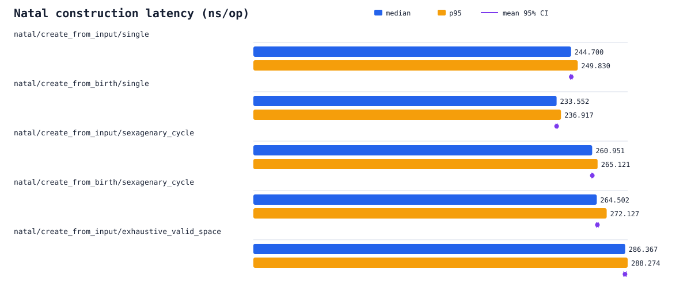
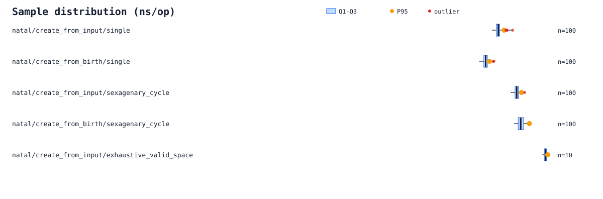
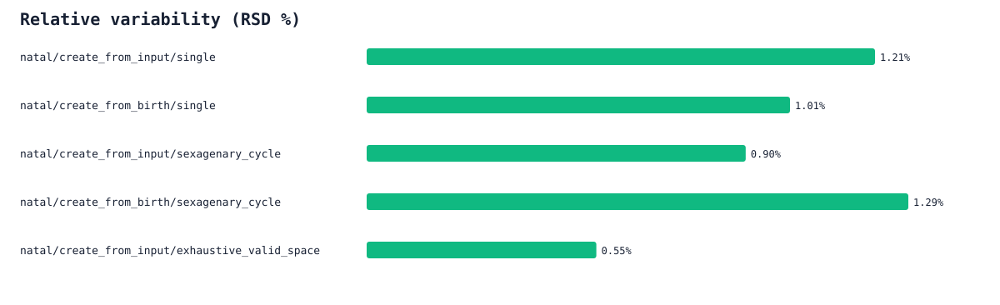

# Ziwei 本命盘构建基准报告

- 结论：`no-baseline`
- Run kind：`full`
- Run ID：`1786764026336980000`
- Revision：`b4724eba7ee7-dirty`
- Git commit：`b4724eba7ee759434358a4bfde9a0454cfd26f76`（工作树有未提交改动）
- Runner：`lzm0x219s-MacBook-Pro.local`
- Zig：`0.16.0`（`stage2_llvm` backend）
- Target：`aarch64-macos-none`
- Optimize：`ReleaseFast`
- CPU：`Apple M4 Max`（14 个逻辑核心）
- OS：`Darwin 25.5.0`
- Environment：`36aef1943fe9a8e6e72723793c3ac8547b77374a37111a8b086f857e49193bfb`
- Fixture：`natal-v1`
- `@sizeOf(Natal)`：`2412 bytes`
- 配置：warm-up `60`，样本 `100`，目标样本时长 `50 ms`，交错 seed `1592598566`

## 大白话总结

这份报告能说明程序现在大约有多快，但没有同一环境下的旧结果，所以还不能判断是变快还是变慢。

- 这次只测本命盘构建，不包含只读查询，也不包含文件读写、网络请求和历法换算。
- 在这台机器的纯计算循环里，构建一张本命盘通常约需 0.234–0.286 微秒；连续单线程计算时，相当于每秒约 3.49–4.28 百万张。
- 本轮最快的是“出生资料的单张构建”，约 0.234 微秒/张；最慢的是“全部合法输入组合”，约 0.286 微秒/张，两者相差约 22.6%。
- 两个单张入口中，预处理输入约需 0.245 微秒，出生资料约需 0.234 微秒；从出生资料开始快约 4.8%。
- 把全部合法输入组合都跑一遍后，折算到每张约需 0.286 微秒；这个数字已经包含在上面的最快—最慢范围里。
- 这次没有同一环境下的旧结果，所以只能说明当前速度，不能判断升降；可以保存本次 `results.json`，供以后在同一环境中比较。

## 结果

| 基准 | P50 | P95 | P99 | Mean | MAD | 95% mean CI | RSD | Outliers (severe) | Throughput |
| --- | ---: | ---: | ---: | ---: | ---: | ---: | ---: | ---: | ---: |
| `natal/create_from_input/single` | 244.700 | 249.830 | 252.511 | 244.831 | 1.624 | [244.250, 245.412] | 1.21% | 5 (1)/100 | 4086639 op/s |
| `natal/create_from_birth/single` | 233.552 | 236.917 | 240.400 | 233.555 | 1.603 | [233.093, 234.016] | 1.01% | 2 (0)/100 | 4281708 op/s |
| `natal/create_from_input/sexagenary_cycle` | 260.951 | 265.121 | 266.981 | 261.040 | 1.504 | [260.578, 261.502] | 0.90% | 1 (0)/100 | 3832142 op/s |
| `natal/create_from_birth/sexagenary_cycle` | 264.502 | 272.127 | 273.038 | 264.959 | 2.420 | [264.289, 265.629] | 1.29% | 0 (0)/100 | 3780685 op/s |
| `natal/create_from_input/exhaustive_valid_space` | 286.367 | 288.274 | 288.312 | 286.215 | 1.050 | [285.245, 287.185] | 0.55% | 0 (0)/10 | 3492021 op/s |

## 图表

## 测量边界

- 本轮只测量 `createFromInput` 与 `createFromBirth` 的本命盘构建，不包含只读查询。
- `sexagenary_cycle` 每次迭代覆盖 60 个干支年，并轮换性别、月、日、时辰。
- `exhaustive_valid_space` 每次迭代覆盖 518,400 个合法 `ZiweiInput` 组合；为控制总时长，最多采集 10 个样本。
- 夹具准备、统计与报告写出均位于计时区外；构建结果通过 `std.mem.doNotOptimizeAway` 保留。
- 不同 case 的 warm-up 与正式样本按固定 seed 随机交错，以减轻时间顺序偏差。
- 单次结果的 95% mean CI 使用 `mean ± 1.96 × standard error`；相对 median 变化使用 1,000 次确定性 bootstrap；异常值使用 `1.5 × IQR` 判定。
- `smoke` 只验证基准与报告管线，不产生可比较的性能结论。
- baseline 比较要求 schema、run kind、采样配置、Zig、backend、target、optimize mode、fixture 与 case 合同一致；仍应在同一固定 runner 上运行。

原始样本与机器可读摘要见 [`results.json`](results.json)、[`summary.csv`](summary.csv) 和 [`samples.csv`](samples.csv)。
